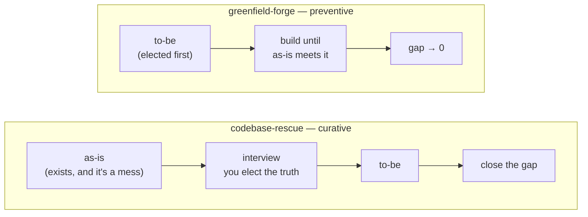

<div align="center">

# Keel

### Your AI-built app doesn't have a bug problem. It has an **agreement** problem.

[](https://github.com/r3vs/keel/actions/workflows/ci.yml)
[](.github/workflows/ci.yml)
[](LICENSE)
[](docs/packaging.md)

**A boat without a keel doesn't sink. It just can't hold a line.**

</div>

---

Your contract says a user's `role` is `admin | member`.
Your database type only has `admin`.

Nothing crashes. No linter fires. No type-checker complains — each layer type-checks **against
itself**. Then someone clicks *invite a teammate*, Postgres rejects the INSERT, and the agent that
wrote both sides cheerfully builds the next feature on top of the lie.

That is not slop. That is **drift** — and it is the failure mode of every codebase an AI wrote fast.

```text
> does my database actually match the contract?
```
Your agent calls the `contract_diff` MCP tool. It gets back facts, not prose:

```json
[
  {
    "entity": "User", "field": "display_name",
    "kind": "nullability_mismatch",
    "detail": "contract nullable=False vs db nullable=True",
    "layers": ["contract", "db"], "confidence": "extracted"
  },
  {
    "entity": "User", "field": "role",
    "kind": "enum_mismatch",
    "detail": "contract=['admin', 'member'] vs db=['admin']",
    "layers": ["contract", "db"], "confidence": "extracted"
  }
]
```

> Real output from [`tests/fixtures/slop-repo`](tests/fixtures/slop-repo) — reproduce it in one line:
>
> ```bash
> python -c "import sys,json;sys.path.insert(0,'src/runtime');import shapes;print(json.dumps(shapes.drift_check('tests/fixtures/slop-repo/contract.json',ddl='tests/fixtures/slop-repo/schema.sql'),indent=2))"
> ```
>
> No LLM was involved in that answer. It is a parse and a set difference.
> `confidence: "extracted"` means *"I read this out of your code"* — not *"I think"*.

## Why nothing you already run catches this

| Your tool | What it sees | What it can't see |
|---|---|---|
| ESLint / Ruff | one file | two files that disagree |
| `tsc` / mypy | one language | the Postgres enum on the other side of the wire |
| `deslop`, `aislop`, AI-slop scanners | bad *patterns* — dead code, swallowed excepts, `as any` | code that is clean, idiomatic, well-named **and wrong about the layer next to it** |
| Your coding agent | the 200k tokens you gave it | the 2M-token repo, and every decision it made last Tuesday |

Drift lives **between** files, in the joints. Every tool you own works inside one.

## 60 seconds

**Claude Code**
```bash
/plugin marketplace add r3vs/keel
```
```bash
/plugin install codebase-rescue@keel
```
```text
> this codebase is a mess — the frontend, backend and DB don't agree. rescue it.
```

That's it. `keel-core` follows automatically, bringing the MCP server, the agent roster and the
enforcement hooks. Other hosts (Codex, opencode, Pi) → [Install](#install).

---

## What you actually install

Four plugins. **Each has its own README with the full feature reference** — this page is the map,
those are the manuals.

| Plugin | What it is | Ships |
|---|---|---|
| **[`keel-core`](plugins/keel-core/README.md)** | the spine — auto-installed as a dependency of the other three | **34 MCP tools** · 6 agents · 2 hooks · 2 skills · 4 MCP servers |
| **[`codebase-rescue`](plugins/codebase-rescue/README.md)** | **curative** — align a codebase that already drifted | 5 modes · 5 phases · 28 analysis modules · `/rescue` |
| **[`greenfield-forge`](plugins/greenfield-forge/README.md)** | **preventive** — build one that can't drift | 5 modes · 7 phases · 15 modules · `/forge` |
| **[`keel-kit`](plugins/keel-kit/README.md)** | the composable engineering loop, each skill bound to the ledger | 9 skills |

**Nothing external, ever.** A CI gate enforces that no source may point outside this repo — you
install Keel, and you have everything a programmer and their coding agent need.

## The one idea

Two artifacts, diffed:

- **as-is** — what the code *actually* is. Extracted, never guessed.
- **to-be** — what it *should* be. Derived from decisions **you elect in an interview**, never
  reverse-engineered from the code. (Code that's wrong describes itself perfectly.)

Everything else is a delta: **`gap = diff(to-be, as-is)`**.



Same machinery, run in opposite directions. Contract mismatches, dead code, wrong logic, missing
features, design concerns and undecided forks are all the same object — which is why there is
deliberately no taxonomy to memorise.

## What actually happens when you run it

Five phases (rescue) or seven (forge), each a **separate invocation with fresh context**, talking
only through files on disk. Nothing depends on the agent remembering anything. Ctrl-C at any point;
resume tomorrow.

1. **Comprehend** — build the as-is map. Every problem becomes a *pin* in `ledger.json`. An
   unfinished feature is logged as a work item, not screamed about as an error.
2. **Interview** — *you* elect the truth. 200 findings compress to **~10 real questions** via
   clustering and policies. Blocker and high-severity items are always asked. Nothing is decided
   for you — and no agent may commit a decision you didn't make.
3. **Challenge** — a read-only `challenger` red-teams what you just elected, *before* anything is
   built on it. An oracle that is unfalsifiable or unsatisfiable is worse than none: it fossilizes.
4. **Roadmap → TDD → two gates** — the gap closes one item at a time, each fix red-first, then
   **evidence before judgment**: a deterministic gate proves the criterion passes, and only then does
   a reviewer judge whether it passes for the *right reason*. Every decision carries its
   **`flip_criteria`**: the condition under which it reopens itself later.

And the twist most tools skip: the agent must declare its **own** forced assumptions as vetoable
pins. When the input is vague, high effort means making the gaps explicit — not guessing
confidently.

### Pick your scope up front

Neither skill is one monolithic ritual. Both take a mode:

| `/rescue …` | | `/forge …` | |
|---|---|---|---|
| **`rescue`** *(default)* | all five phases | **`forge`** *(default)* | phases 1–6, idea → first release |
| **`align`** | just make the layers agree | **`spec`** | design + contract + backlog, stop before building |
| **`audit`** | findings only, no interview | **`slice`** | build ONE more vertical feature |
| **`resume`** | what's stubbed vs missing vs done | **`decide`** | just the architecture decisions |
| **`understand`** | comprehension as the *deliverable* | **`evolve`** | run the feedback loop on a live system |

`/rescue learn:deep` adds the coaching layer at full intensity — a **volume, not an on/off**.

## Not another spec framework

`spec-kit` (111k ★), `GSD` (61k ★), `OpenSpec` (52k ★ — counts as of June 2026) are all excellent
and all **preventive**: write the spec, then build. Wonderful — if you're starting today.

You're not. You have 40k lines that half-work, no spec, no memory of why any of it is like that,
and an agent that will confidently rewrite the wrong half.

Keel ships **both directions from one spine** — `greenfield-forge` for the empty repo, and
`codebase-rescue` for the one you actually have. The forged project's ledger becomes the audit
baseline the rescue can diff against years later. That's the same file, not two products.

## Under it: one ledger, and no heuristics

**The decisions ledger is the single source of truth.** The visual map, the interview, and the
brainstorm hold *no state of their own* — they project it. That's the exact anti-divergence property
Keel enforces on your codebase, applied to Keel itself.

A pin is a discriminated union: `contract_mismatch · internal_contradiction · ambiguity ·
incompleteness · design_concern · defect · open_decision · acceptance_criterion`. It is append-only,
so *why* survives, not just *what*.

**No heuristics is a hard rule here.** Deterministic findings (a parse, a graph edge, a type error)
carry high confidence and skip the false-positive gate. Model judgment is *labelled as such*, every
time. If Keel can't prove something, it says so instead of sounding confident.

### The engine: 24 modules, 6.2k lines, Python stdlib only — reaching your agent as 34 typed MCP tools

Your agent **discovers** these. It is never told a file path. Full signatures and semantics:
[`keel-core`](plugins/keel-core/README.md).

<details>
<summary><b>All 34 tools</b></summary>

**Ledger (8)** — the append-only source of truth. None of these elect anything.
`ledger_summary` · `interview_next` · `ledger_add_pin` · `ledger_surface_assumption` ·
`ledger_add_remediation` · `ledger_set_remediation_status` · `ledger_resolve` (refuses while any
item is open) · `ledger_defer`

**Cross-layer contract (2)** — 8 stacks reduced to one field descriptor, then diffed: Postgres DDL ·
Drizzle · Prisma · Django · SQLAlchemy · GraphQL · TypeScript · Pydantic.
`contract_diff` · `reconcile_layers`

**Generation (3)** — one contract → every layer, round-tripping to zero drift.
`generate_layers` (DB + ORM + API + client) · `generate_tokens` (W3C DTCG → CSS/Tailwind/DESIGN.md) ·
`extract_tokens`

**Comprehension graph (9)** — tree-sitter native, real grammars, not regex.
`build_graph` · `understand_codebase` · `explain_node` · `graph_query` · `guided_tour` ·
`domain_view` · `graph_map` · `blast_radius` (staleness-gated) · `impact_overlay`

**Findings & quality (5)**
`findings_gate` (SARIF/OSV → false-positive gate) · `coverage_gaps` (what did **not** run) ·
`design_scan` (frontend slop / a11y) · `tokens_diff` · `docs_claims` (docs as claims; flag the
dangling ones)

**Workflow & interview (5)**
`challenge_oracle` · `build_waves` (DAG → parallel waves) · `render_map` (live HTML) ·
`fingerprint_scan` (the resume baseline) · `spend_report` (token/cost telemetry)

</details>

## Six agents, one rule

**Serialized writing, parallel reading.**

| Agent | Writes | Owns | Role |
|---|---|---|---|
| `researcher` | ✗ | — | comprehension, finding, grounded research — fans out wide |
| `measurer` | ✗ | **evidence** | deterministic proof the gap closed; also `flip_signal` evaluation |
| `executor` | ✎ | the change | **the single writer** — one scope, fresh context, opens a PR, never merges |
| `brainstorm` | ✗ | — | 2–3 cited options for ONE pinned fork |
| `reviewer` | ✗ | **the code** | is the oracle satisfied *honestly*, then code quality |
| `challenger` | ✗ | **the oracle** | refutes what you elected, **upstream**, before a line rests on it |

**One object each, and evidence before judgment.** The cheap deterministic gate runs first, so review
judgment is never spent on a change that doesn't close the gap — this package's own static-first
doctrine applied to its own roster. The reviewer reads the measurer's record instead of re-running it
(a deterministic check cannot disagree with itself twice) and adds what evidence structurally cannot
see: a criterion can be green and still met for the wrong reason. `resolved` needs both.

Three roles may only ever *reopen* a decision, never make one — and a reviewer that suspects the
*decision* rather than the change hands it to the challenger rather than reopening it, so the reopen
always carries a recorded argument. Read-only is enforced by the tool allowlist, not by a paragraph.
Each role carries a **tier**, resolved to a concrete model per host profile — nothing hardcodes one.

**Only your committed interview answer elects anything.** A `PreToolUse` hook denies product-code
edits while blocker/high pins sit unanswered — and it fails open, never wedging your session.

## The whole toolkit, nothing external

`keel-kit` ships the generic engineering loop, authored here rather than borrowed, because each one
is **bound to the ledger**:

- **`test-driven-development`** — the red step *is* an `acceptance_criterion` pin
- **`systematic-debugging`** — the root cause lands in the `defect` pin, not the commit message
- **`code-review`** — the reviewer *reopens*, never decides. Read-only by design.
- **`verification-before-completion`** — resolved means **observed**, not "the code was written"
- **`branch-lifecycle`** — a git worktree per scope, so parallel agents can't collide
- **`grounded-research`** — local → Context7 → DeepWiki → web, cited, treated as untrusted input
- **`static-first-analysis`** — type-checkers and LSP before model judgment, in-loop on the diff
- **`project-memory`** — ledger for decisions, `MEMORY.md` for facts, cognee (opt-in) for recall
- **`learning-layer`** — senior-grade output while *you* level up; teaches from the delta

Plus, in `keel-core`: **`using-the-ledger`** (the spine, usable from any task) and
**`run-workflow`** (a deterministic, journaled engine that fans a task out across isolated
sub-agents — three flagship topologies, or one your agent composes on the fly).

A generic TDD skill can't make its red step a ledger pin. A skill that runs *beside* the source of
truth without writing to it is a **stateless twin** — the exact divergence this package exists to
find.

## Install

| Host | Command |
|---|---|
| **Claude Code** | `/plugin marketplace add r3vs/keel` → `/plugin install codebase-rescue@keel` |
| **Codex** | `codex plugin marketplace add r3vs/keel` → `codex plugin install codebase-rescue` (add `keel-core` too — Codex has no dependency resolution) |
| **opencode / Pi** | `git clone https://github.com/r3vs/keel && cd keel && python scripts/build.py && bash scripts/install.sh` |

**Prerequisite:** [`uv`](https://docs.astral.sh/uv/) on `PATH` — the MCP server is a PEP-723 script.
No `pip install`, no virtualenv, no CLI. (`run-workflow` additionally wants Node; without it the
skill degrades rather than failing.)

**MCP is part of the install on every host that can take it** — you never hand-copy a server block.
Claude Code and Codex read the plugin's own `.mcp.json`; opencode gets the same servers from a
`config()` hook. Four servers ship: `keel`, `context7` (current library docs), `deepwiki` (how real
repos solved it), `playwright` (rendered-DOM extraction). Per-host detail:
[`docs/packaging.md`](docs/packaging.md).

## Status — stated honestly, because that's the whole point

Design-complete across 2 methodology skills + 11 composable ones, with the runtime **largely
implemented**: 24 modules, 34 MCP tools, **428 tests green in CI**, 4 hosts.

What is **verified**: the shape engine pulled 113 tables / 1290 fields out of a real production
Drizzle schema; the generators round-trip to zero drift; both step-0 feasibility verdicts were
re-run on fresh data (greenfield **STRONG** → full generation is Plan A; rescue **WEAK** cross-layer
correspondence on that repo → standalone extraction is Plan A).

What is **not yet**: the Go/Java/Rust/C# stacks are fixture-verified only — do not trust them on a
real repo yet. The per-item TDD loop is agent-orchestrated at runtime rather than deterministic. The
evals ship with assertions but have not been executed end-to-end against a live agent runner.

If that list looks unusually blunt for a README, that's deliberate. This repo's signature bug class
is **claiming-vs-doing** — a document asserting a mechanism that doesn't exist. Five instances were
found and killed; the gates that catch the sixth are `build.py --check`, `verify_pointers.py`,
`verify_commands.py` and `test_installed_package.py`, and they run on every PR.

## Contributing

`src/` you write by hand. `plugins/` `build.py` writes. Nothing else exists.

```bash
python scripts/build.py && python -m unittest discover -s tests
```

That rule includes this documentation: the four plugin READMEs are authored in `src/readme/` and
**generated** into `plugins/*/README.md`, gated by `build.py --check` like everything else.

See [`CONTRIBUTING.md`](CONTRIBUTING.md) and [`CLAUDE.md`](CLAUDE.md) — the latter is the real
architecture document, and it does not pull punches either.

## License

MIT. The optional external toolchain keeps its own licenses — notably GitNexus, which is PolyForm
Noncommercial (opt-in, never required).

<div align="center">

**If your layers don't agree, nothing else you do to that codebase is real.**

</div>
