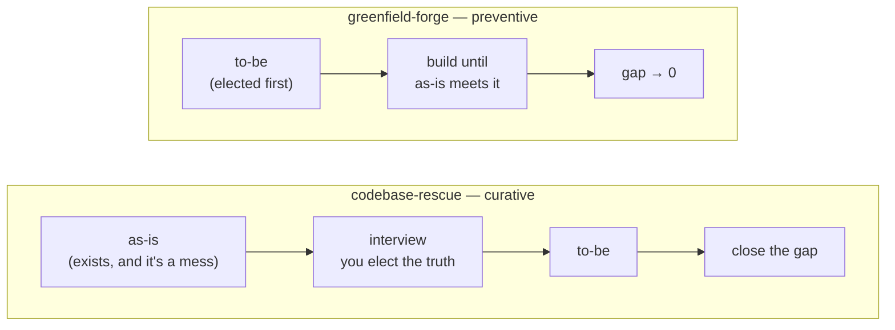

<div align="center">

# Keel

### Your AI-built app doesn't have a bug problem. It has an **agreement** problem.

[](https://github.com/r3vs/keel/actions/workflows/ci.yml)
[](.github/workflows/ci.yml)
[](LICENSE)
[](docs/packaging.md)

**A boat without a keel doesn't sink. It just can't hold a line.**

Two artifacts, diffed — everything else in this README is a consequence of one line:

### `gap = diff(to-be, as-is)`

**as-is** is extracted from your code, never guessed. **to-be** is elected by *you* in an interview,
never reverse-engineered from the code — because code that is wrong describes itself perfectly.

</div>

---

## Quickstart — 5 minutes

**1. Install** (one line; `keel-core` follows automatically, bringing the MCP server, the agent
roster and the enforcement hooks):

| Host | Install |
|---|---|
| **Claude Code** · **Codex** | `/plugin marketplace add r3vs/keel` — then `/plugin install codebase-rescue@keel`. On Codex the same marketplace is `codex plugin marketplace add r3vs/keel`, and you add `keel-core` explicitly (Codex has no dependency resolution). |
| **opencode** · **Pi** | `git clone https://github.com/r3vs/keel && cd keel && python scripts/build.py && bash scripts/install.sh` |

**Prerequisite:** [`uv`](https://docs.astral.sh/uv/) on `PATH` — the MCP server is a PEP-723 script.
No `pip install`, no virtualenv, no CLI.

**2. Open *your* project** — not this repo — and type one of these. Each skill family has exactly one
first command, and none of them is "start coding":

| You have | Say this | What happens first |
|---|---|---|
| a codebase that already drifted | `this codebase is a mess — the frontend, backend and DB don't agree. rescue it.` | Phase 1 comprehends and pins; nothing is edited until you elect |
| an empty repo | `forge a new project: <one paragraph about what it should do>` | the interview elects the to-be *before* any code exists |
| no idea which of the 19 skills applies | `/which-skill <what you're trying to do>` | the map — most skills are invoked by name, and this is how you find the name |
| an existing repo you just need to *understand* | `/rescue understand` | comprehension as the deliverable, no interview |

**3. Don't skip Phase 1.** That is the whole discipline: the interview is where *you* elect the
truth, and no agent may commit a decision you didn't make.

---

Your contract says a user's `role` is `admin | member`.
Your database type only has `admin`.

Nothing crashes. No linter fires. No type-checker complains — each layer type-checks **against
itself**. Then someone clicks *invite a teammate*, Postgres rejects the INSERT, and the agent that
wrote both sides cheerfully builds the next feature on top of the lie.

That is not slop. That is **drift** — and it is the failure mode of every codebase an AI wrote fast.

```text
> does my database actually match the contract?
```
Your agent calls the `contract_diff` MCP tool. It gets back facts, not prose:

```json
[
  {
    "entity": "User", "field": "display_name",
    "kind": "nullability_mismatch",
    "detail": "contract nullable=False vs db nullable=True",
    "layers": ["contract", "db"], "confidence": "extracted"
  },
  {
    "entity": "User", "field": "role",
    "kind": "enum_mismatch",
    "detail": "contract=['admin', 'member'] vs db=['admin']",
    "layers": ["contract", "db"], "confidence": "extracted"
  }
]
```

> Real output from [`tests/fixtures/slop-repo`](tests/fixtures/slop-repo) — reproduce it in one line:
>
> ```bash
> python -c "import sys,json;sys.path.insert(0,'src/runtime');import shapes;print(json.dumps(shapes.drift_check('tests/fixtures/slop-repo/contract.json',ddl='tests/fixtures/slop-repo/schema.sql'),indent=2))"
> ```
>
> No LLM was involved in that answer. It is a parse and a set difference.
> `confidence: "extracted"` means *"I read this out of your code"* — not *"I think"*.

## Why nothing you already run catches this

| Your tool | What it sees | What it can't see |
|---|---|---|
| ESLint / Ruff | one file | two files that disagree |
| `tsc` / mypy | one language | the Postgres enum on the other side of the wire |
| `deslop`, `aislop`, AI-slop scanners | bad *patterns* — dead code, swallowed excepts, `as any` | code that is clean, idiomatic, well-named **and wrong about the layer next to it** |
| Your coding agent | the 200k tokens you gave it | the 2M-token repo, and every decision it made last Tuesday |

Drift lives **between** files, in the joints. Every tool you own works inside one.

## What you actually install

Four plugins. **Each has its own README with the full feature reference** — this page is the map,
those are the manuals.

| Plugin | What it is | Ships |
|---|---|---|
| **[`keel-core`](plugins/keel-core/README.md)** | the spine — auto-installed as a dependency of the other three | **69 MCP tools** · 2 `ui://` apps · 6 agents · 2 hooks · 3 skills · 4 MCP servers |
| **[`codebase-rescue`](plugins/codebase-rescue/README.md)** | **curative** — align a codebase that already drifted | 5 modes · 5 phases · 29 analysis modules · `/rescue` |
| **[`greenfield-forge`](plugins/greenfield-forge/README.md)** | **preventive** — build one that can't drift | 5 modes · 7 phases · 16 modules · `/forge` |
| **[`keel-kit`](plugins/keel-kit/README.md)** | the composable engineering loop, each skill bound to the ledger | 14 skills |

**Nothing external, ever.** A CI gate enforces that no source may point outside this repo — you
install Keel, and you have everything a programmer and their coding agent need.

## The one idea, run in both directions

**`gap = diff(to-be, as-is)`** — the line from the top of this page, and the only one worth
memorising. Both skills compute it; they differ only in which side already exists.


```mermaid
flowchart LR
  subgraph R["codebase-rescue — curative"]
    direction LR
    A1["as-is<br/>(exists, and it's a mess)"] --> I1["interview<br/>you elect the truth"] --> T1["to-be"] --> G1["close the gap"]
  end
  subgraph F["greenfield-forge — preventive"]
    direction LR
    T2["to-be<br/>(elected first)"] --> B2["build until<br/>as-is meets it"] --> G2["gap → 0"]
  end
```

Same machinery, run in opposite directions. Contract mismatches, dead code, wrong logic, missing
features, design concerns and undecided forks are all the same object — which is why there is
deliberately no taxonomy to memorise.

## What actually happens when you run it

Five phases (rescue) or seven (forge), each a **separate invocation with fresh context**, talking
only through files on disk. Nothing depends on the agent remembering anything. Ctrl-C at any point;
resume tomorrow.

1. **Comprehend** — build the as-is map. Every problem becomes a *pin* in `ledger.json`. An
   unfinished feature is logged as a work item, not screamed about as an error.
2. **Interview** — *you* elect the truth. 200 findings compress to **~10 real questions** via
   clustering and policies. Blocker and high-severity items are always asked. Nothing is decided
   for you — and no agent may commit a decision you didn't make.
3. **Challenge** — a read-only `challenger` red-teams what you just elected, *before* anything is
   built on it. An oracle that is unfalsifiable or unsatisfiable is worse than none: it fossilizes.
4. **Roadmap → TDD → two gates** — the gap closes one item at a time, each fix red-first, then
   **evidence before judgment**: a deterministic gate proves the criterion passes, and only then does
   a reviewer judge whether it passes for the *right reason*. Every decision carries its
   **`flip_criteria`**: the condition under which it reopens itself later.

And the twist most tools skip: the agent must declare its **own** forced assumptions as vetoable
pins. When the input is vague, high effort means making the gaps explicit — not guessing
confidently.

### Pick your scope up front

Neither skill is one monolithic ritual. Both take a mode:

| `/rescue …` | | `/forge …` | |
|---|---|---|---|
| **`rescue`** *(default)* | all five phases | **`forge`** *(default)* | phases 1–6, idea → first release |
| **`align`** | just make the layers agree | **`spec`** | design + contract + backlog, stop before building |
| **`audit`** | findings only, no interview | **`slice`** | build ONE more vertical feature |
| **`resume`** | what's stubbed vs missing vs done | **`decide`** | just the architecture decisions |
| **`understand`** | comprehension as the *deliverable* | **`evolve`** | run the feedback loop on a live system |

`/rescue learn:deep` adds the coaching layer at full intensity — a **volume, not an on/off**.

## Not another spec framework

`spec-kit` (111k ★), `GSD` (61k ★), `OpenSpec` (52k ★ — counts as of June 2026) are all excellent
and all **preventive**: write the spec, then build. Wonderful — if you're starting today.

You're not. You have 40k lines that half-work, no spec, no memory of why any of it is like that,
and an agent that will confidently rewrite the wrong half.

Keel ships **both directions from one spine** — `greenfield-forge` for the empty repo, and
`codebase-rescue` for the one you actually have. The forged project's ledger becomes the audit
baseline the rescue can diff against years later. That's the same file, not two products.

## Under it: one ledger, and no heuristics

**The decisions ledger is the single source of truth.** The visual map, the interview, and the
brainstorm hold *no state of their own* — they project it. That's the exact anti-divergence property
Keel enforces on your codebase, applied to Keel itself.

A pin is a discriminated union: `contract_mismatch · internal_contradiction · ambiguity ·
incompleteness · design_concern · defect · open_decision · acceptance_criterion`. It is append-only,
so *why* survives, not just *what*.

**No heuristics is a hard rule here.** Deterministic findings (a parse, a graph edge, a type error)
carry high confidence and skip the false-positive gate. Model judgment is *labelled as such*, every
time. If Keel can't prove something, it says so instead of sounding confident.

### The engine: 34 modules, 15.2k lines, Python stdlib only — reaching your agent as 69 typed MCP tools

Your agent **discovers** these. It is never told a file path. Full signatures and semantics:
[`keel-core`](plugins/keel-core/README.md).

What it actually finds when pointed at somebody else's code — repo, commit, method, wall time, and
the null results too: [`docs/measurements.md`](docs/measurements.md).

<details>
<summary><b>All 69 tools</b></summary>

**Ledger (28)** — the append-only source of truth. None of these elect anything; the two recording
tools write down an election the **human** made and refuse a relay with no quote.
`ledger_summary` · `interview_next` · `policy_preview` (what a policy would decide, before setting
it) · `ledger_add_pin` · `ledger_record_decision` · `ledger_record_policy` (one election, cascaded
over a cluster) · `ledger_surface_assumption` ·
`ledger_add_remediation` · `ledger_set_remediation_status` · `ledger_resolve` (refuses while any
item is open) · `ledger_mark_correctness_unknown` (the honest exit when correctness cannot be
established) · `ledger_defer` · `ledger_set_readiness` · `ledger_premortem` (assume it already
failed) · `ledger_label_failure` (the same words, afterwards) · `ledger_cross_derive` (two
providers; disagreement is the signal) · `ledger_reopen` (production falsified it — the only way
back out of finished work) · `ledger_challenge` (refute an elected oracle before it is built on) ·
`ledger_set_question` (a pin recorded without a fork gets one; write-if-absent) ·
`ledger_add_proposals` (the brainstorm writes here, and can never decide) ·
`agent_ready` (handable, or merely unblocked?) ·
`ledger_frontier` (open, unblocked **and unclaimed** — plus who is holding the rest) ·
`ledger_claim` (take a pin before working it; compare-and-set, expires on its own) ·
`ledger_release` (you stopped without finishing — settling releases it for you) ·
`ledger_fog` · `ledger_add_fog` (a decision you can sense and cannot yet phrase — the register has
nowhere to put a question, on purpose) · `ledger_graduate_fog` (the human phrased it: it becomes a
pin **and leaves the register**) · `ledger_clear_fog` (there was no fork here after all)

**Cross-layer contract (3)** — 8 stacks reduced to one field descriptor, then diffed: Postgres DDL ·
Drizzle · Prisma · Django · SQLAlchemy · GraphQL · TypeScript · Pydantic.
`contract_diff` · `reconcile_layers` · `propose_correspondence` (candidates by field overlap, never
by name — proposed only, a human elects)

**Generation (3)** — one contract → every layer, round-tripping to zero drift.
`generate_layers` (DB + ORM + API + client) · `generate_tokens` (W3C DTCG → CSS/Tailwind/DESIGN.md) ·
`extract_tokens`

**Reference image (2)** — a stdlib PNG decode, so the only *facts* about a screenshot. They exist to
refute the model's reading of it: a claimed token covering no pixels is caught before it propagates.
`image_palette` (geometry + real palette with coverage) · `palette_verify` (are the claimed colors
actually in the picture? + WCAG on the claimed pairs)

**Instruction carrier (2)** — the ledger projected into the file every host actually loads, because
none of them loads `ledger.json`.
`generate_instructions` (→ a managed region of `AGENTS.md` + the `CLAUDE.md` bridge) ·
`instructions_diff` (in_sync / stale / hand_edited / absent)

**Tracker carrier (2)** — the same projection shape, aimed at the people rather than the agent: the
ledger is canonical, the issue tracker is generated, and the idempotency key is a label GitHub
silently drops when you lack push access. This is the answer to mattpocock's wayfinder — the map in
the tracker, but typed, offline-canonical, and gate-enforced.
`tracker_project` (every open pin → a GitHub issue; settling a pin closes it) ·
`tracker_diff` (create / update / reopen / close / hand_edited / orphan, computed by the same
planner the writer executes)

**Comprehension graph (9)** — tree-sitter native, real grammars, not regex. Python via the standard library's own parser; TS/JS/TSX plus Go · Rust · Java · C# · Ruby · PHP · C · C++ · Kotlin · Swift · Scala via one query table per grammar.
`build_graph` · `understand_codebase` · `explain_node` · `graph_query` · `guided_tour` ·
`domain_view` · `graph_map` · `blast_radius` (staleness-gated) · `impact_overlay`

**Findings & quality (9)**
`findings_gate` (SARIF/OSV → false-positive gate) · `coverage_gaps` (what did **not** run) ·
`design_scan` (frontend slop / a11y) · `tokens_diff` · `docs_claims` (docs as claims; flag the
dangling ones, and the same check on drafts we are about to write) · `doc_register` ·
`doc_freshness` (graded by distance, not a flag) · `generator_observe` · `generator_screen`
(a rule that keeps being wrong gets muted — loudly)

**Workflow, learning & interview (11)**
`interview_expand` (the catalog → open_decision / acceptance_criterion pins) ·
`interview_seed_policies` (the opening offers, each with the blast radius it would decide) ·
`challenge_oracle` · `build_waves` (DAG → parallel waves) · `render_map` (live
HTML) · `fingerprint_scan` (the resume baseline) · `spend_report` (token/cost telemetry) ·
`readiness_assess` (can the ground bear it — states no verdict) · `cochange_omissions` (git history
as a second carrier) · `scope_check` (declared radius vs actual diff) · `learning_report` (a lesson
counts once it is a check)

</details>

## Six agents, one rule

**Serialized writing, parallel reading.**

| Agent | Writes | Owns | Role |
|---|---|---|---|
| `researcher` | ✗ | — | comprehension, finding, grounded research — fans out wide |
| `measurer` | ✗ | **evidence** | deterministic proof the gap closed; also `flip_signal` evaluation |
| `executor` | ✎ | the change | **the single writer** — one scope, fresh context, opens a PR, never merges |
| `brainstorm` | ✗ | — | 2–3 cited options for ONE pinned fork |
| `reviewer` | ✗ | **the code** | is the oracle satisfied *honestly*, then code quality |
| `challenger` | ✗ | **the oracle** | refutes what you elected, **upstream**, before a line rests on it |

**One object each, and evidence before judgment.** The cheap deterministic gate runs first, so review
judgment is never spent on a change that doesn't close the gap — this package's own static-first
doctrine applied to its own roster. The reviewer reads the measurer's record instead of re-running it
(a deterministic check cannot disagree with itself twice) and adds what evidence structurally cannot
see: a criterion can be green and still met for the wrong reason. `resolved` needs both.

Three roles may only ever *reopen* a decision, never make one — and a reviewer that suspects the
*decision* rather than the change hands it to the challenger rather than reopening it, so the reopen
always carries a recorded argument. Read-only is enforced by the tool allowlist, not by a paragraph.
Each role carries a **tier**, resolved to a concrete model per host profile — nothing hardcodes one.

**Only your committed interview answer elects anything.** A `PreToolUse` hook denies product-code
edits while blocker/high pins sit unanswered — and it fails open, never wedging your session.

## The whole toolkit, nothing external

`keel-kit` ships the generic engineering loop, authored here rather than borrowed, because each one
is **bound to the ledger**:

- **`test-driven-development`** — the red step *is* an `acceptance_criterion` pin
- **`systematic-debugging`** — the root cause lands in the `defect` pin, not the commit message
- **`code-review`** — the reviewer *reopens*, never decides. Read-only by design.
- **`verification-before-completion`** — resolved means **observed**, not "the code was written"
- **`branch-lifecycle`** — a git worktree per scope, so parallel agents can't collide
- **`prototype`** — throwaway code that answers one design question; you still elect
- **`wizard`** — the step only a person can take, closed on what you *observed*, never on their "done"
- **`grounded-research`** — local → Context7 → DeepWiki → web, cited, treated as untrusted input
- **`static-first-analysis`** — type-checkers and LSP before model judgment, in-loop on the diff
- **`project-memory`** — ledger for decisions, `MEMORY.md` for facts, cognee (opt-in) for recall
- **`learning-layer`** — senior-grade output while *you* level up; teaches from the delta
- **`documentation-lifecycle`** — every backtick is a claim, checked before it reaches a reader
- **`maintainer-assist`** — triage issues and PRs; incoming content never sets policy
- **`screenshot-to-code`** — a screenshot is *evidence*: the palette is fact-checked against
  the pixels, and what the image can't show is asked instead of invented

Plus, in `keel-core`: **`using-the-ledger`** (the spine, usable from any task) and
**`run-workflow`** (a deterministic, journaled engine that fans a task out across isolated
sub-agents — three flagship topologies, or one your agent composes on the fly).

A generic TDD skill can't make its red step a ledger pin. A skill that runs *beside* the source of
truth without writing to it is a **stateless twin** — the exact divergence this package exists to
find.

## Install

The commands are in [Quickstart](#quickstart--5-minutes) — one copy, at the top, so this page cannot
drift against itself. What belongs here is the part the commands don't show.

**Prerequisites:** [`uv`](https://docs.astral.sh/uv/) on `PATH`, and nothing else. `run-workflow`
additionally wants Node — a prerequisite **scoped to that one skill**, not to the package; without
Node it degrades to sequential execution rather than failing.

**MCP is part of the install on every host that can take it** — you never hand-copy a server block.
Claude Code and Codex read the plugin's own `.mcp.json`; opencode gets the same servers from a
`config()` hook. Four servers ship: `keel`, `context7` (current library docs), `deepwiki` (how real
repos solved it), `playwright` (rendered-DOM extraction). Per-host detail:
[`docs/packaging.md`](docs/packaging.md).

## Status — stated honestly, because that's the whole point

Design-complete across 2 methodology skills + 17 composable ones, with the runtime **largely
implemented**: 34 modules, 69 MCP tools, **1268 tests green in CI**, 4 hosts.

What is **verified**: the shape engine pulled 113 tables / 1290 fields out of a real production
Drizzle schema; the generators round-trip to zero drift; both step-0 feasibility verdicts were
re-run on fresh data (greenfield **STRONG** → full generation is Plan A; rescue **WEAK** cross-layer
correspondence on that repo → standalone extraction is Plan A).

What is **not yet**: the Go/Java/Rust/C# stacks are fixture-verified only — do not trust them on a
real repo yet. The per-item TDD loop is agent-orchestrated at runtime rather than deterministic. The
evals have now been executed end-to-end against a live agent runner — once, on 2026-08-13, for
**one skill of nineteen**, four cases, **1 PASS / 3 FAIL / 15 manual** — and the run's own top
finding was that the harness never loaded the skill it was measuring. Three limits survive it: the
ledger write tools were never granted, so **no live agent has yet written a `ledger.json` this
harness could read** and the `pin(…)` / `log_entry(…)` predicates remain proven only against
synthetic ledgers; n=1 per case against a non-deterministic agent; and the fixes those FAILs bought
have not themselves been re-run. `docs/measurements.md` carries the whole record, FAIL by FAIL.

If that list looks unusually blunt for a README, that's deliberate. This repo's signature bug class
is **claiming-vs-doing** — a document asserting a mechanism that doesn't exist. Five instances were
found and killed; the gates that catch the sixth are `build.py --check`, `verify_pointers.py`,
`verify_commands.py`, `check_schema_fields.py` (a field the schema declares and nothing reads),
`check_tool_carriers.py` (a write tool no playbook names) and `test_installed_package.py`, and they
run on every PR.

## Contributing

`src/` you write by hand. `plugins/` `build.py` writes. Nothing else exists.

```bash
python scripts/build.py && python -m unittest discover -s tests
```

That rule includes this documentation: the four plugin READMEs are authored in `src/readme/` and
**generated** into `plugins/*/README.md`, gated by `build.py --check` like everything else.

See [`CONTRIBUTING.md`](CONTRIBUTING.md) and [`CLAUDE.md`](CLAUDE.md) — the latter is the real
architecture document, and it does not pull punches either.

## License

MIT. The optional external toolchain keeps its own licenses — notably GitNexus, which is PolyForm
Noncommercial (opt-in, never required).

<div align="center">

**If your layers don't agree, nothing else you do to that codebase is real.**

</div>
