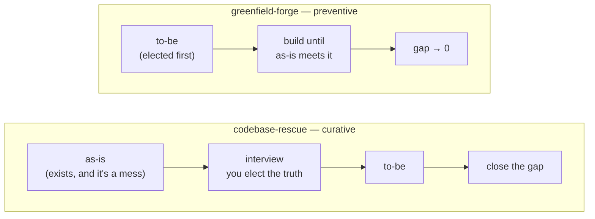

<div align="center">

# Keel

### Your AI-built app doesn't have a bug problem. It has an **agreement** problem.

[](https://github.com/r3vs/keel/actions/workflows/ci.yml)
[](.github/workflows/ci.yml)
[](LICENSE)
[](docs/packaging.md)

**A boat without a keel doesn't sink. It just can't hold a line.**

Two rules. Everything else on this page is a consequence of them.

### `gap = diff(to-be, as-is)`
### every claim is **computed from a carrier** or **elected by you** — a model never just asserts one

</div>

---

## Four things stop agreeing, not one

Keel is often mistaken for a schema-drift checker, because that was the first carrier it shipped and
it makes the best demo. It is one of ten. **Agreement** here means all four of these, and the last
one is the one nothing else on your machine is even looking at:

| What stops agreeing | What it looks like the morning it bites | The carrier that catches it |
|---|---|---|
| **your layers, with each other** | the contract says `role: admin \| member`; Postgres has only `admin`. Nothing crashes — each layer type-checks against *itself* | 12 stack extractors → one field descriptor → a set difference |
| **your code, with what you decided** | you elected *soft delete* in March; half the repo hard-deletes by June, and nobody remembers there was a decision | the decision is an append-only pin carrying its own `flip_criteria` |
| **your docs, with your code** | a README backtick pointing at a symbol that was renamed two refactors ago | every backticked reference resolved against the real graph |
| **your agent's report, with what it actually did** | *"Done — added tests and verified the fix."* It added no tests and ran nothing | a pin resolves on **observed** evidence; a module's run is recorded with a scope somebody else can re-derive |

That last row has a name in this repo — **claiming versus doing** — and it is the failure mode the
2026 literature says is *growing*: across 20,574 real agent sessions, inaccurate self-reporting sits
at **22.58%** and rising in share, while implementation errors decline
([the full citations](docs/open-gaps.md#34-every-carrier-this-package-owns-sits-on-one-interaction-edge--partly-closed-2026-08-17-memory-edge-landed-three-edges-open)).
Your agent is getting better at writing code and worse at telling you what it did.

---

## Quickstart — 5 minutes

**1. Install** (one line; `keel-core` follows automatically, bringing the MCP server, the agent
roster and the enforcement hooks):

| Host | Install |
|---|---|
| **Claude Code** · **Codex** | `/plugin marketplace add r3vs/keel` — then `/plugin install codebase-rescue@keel`. On Codex the same marketplace is `codex plugin marketplace add r3vs/keel`, and you add `keel-core` explicitly (Codex has no dependency resolution). |
| **opencode** · **Pi** | `git clone https://github.com/r3vs/keel && cd keel && python scripts/build.py && bash scripts/install.sh` |

**Prerequisite:** [`uv`](https://docs.astral.sh/uv/) on `PATH` — the MCP server is a PEP-723 script.
No `pip install`, no virtualenv, no CLI.

**2. Open *your* project** — not this repo — and type one of these. Every entry point starts with
comprehension or election; **none of them is "start coding":**

| You have | Say this | What happens first |
|---|---|---|
| a codebase that already drifted | `this codebase is a mess — nothing agrees with anything. rescue it.` | Phase 1 comprehends and pins; nothing is edited until you elect |
| an empty repo | `forge a new project: <one paragraph about what it should do>` | the interview elects the to-be *before* any code exists |
| a repo you just need to **understand** | `/rescue understand` | comprehension as the deliverable — graph, tours, domain map, no interview |
| a screenshot you want built | *paste the image* | the palette is fact-checked against the pixels; what the image can't show is asked, not invented |
| something broken | `/systematic-debugging` | a loop that goes red on it, before any fix is attempted |
| no idea which of the 19 skills applies | `/which-skill <what you're trying to do>` | the map — most skills are invoked by name, and this is how you find the name |

**3. Don't skip Phase 1.** That is the whole discipline: the interview is where *you* elect the
truth, and no agent may commit a decision you didn't make.

---

## The rule under everything

A coding agent makes roughly fifteen kinds of claim in a working session — *this field is nullable,
this function is dead, this doc is current, this fix is verified, this is what you asked for*. Keel's
position is that each one is either **computed from a carrier** you can re-derive, or **elected by a
human** who is accountable for it. A model's confident sentence is neither, and gets labelled as
neither.

That is why `confidence` is a field and not a vibe. A parse, a graph edge, a set difference, a pixel
count → `extracted`, and it **skips the false-positive gate** because there is nothing to be false
about. A model's reading → `inferred`, and it goes through the gate every time. When Keel can't prove
something it says so — there is a whole ledger state, `correctness_unknown`, whose only job is to be
the honest exit.

### The carriers, and the honest measurement

The layer differ is the famous one. It is **16% of the runtime**. `ledger.py` alone is 26%. That
number is measured, published, and the reason this page was rewritten:

| Carrier | Turns into a fact | Tools |
|---|---|---|
| a parse of two schemas | field-level drift across **12 stack extractors** (8 wired into the contract diff) | `contract_diff` · `reconcile_layers` |
| a tree-sitter graph over 14 languages | who calls what · what breaks if this changes | `build_graph` · `blast_radius` · `impact_overlay` |
| **git history** | files this change historically would have touched and did not | `cochange_omissions` |
| **the pixels of a PNG** | which colors are *actually* in the mockup, over what fraction of the frame | `image_palette` · `palette_verify` |
| a SARIF / OSV report + each rule's recorded precision | findings routed by their generator's track record — nothing deleted, only routed | `findings_gate` · `generator_screen` |
| every backtick in your docs | a claim that resolves against the graph, or doesn't | `docs_claims` · `doc_freshness` |
| the declared radius vs the actual diff | did the change stay inside the boundary it announced | `scope_check` |
| **the ledger itself** | six of the eight documented ways a durable memory rots — and the two it says plainly it cannot decide | `memory_audit` |
| the host's own session transcript | tokens, and with a price sheet, cost | `spend_report` |
| **nothing — a human elected it** | the to-be | the interview |

<details>
<summary><b>Reproduce the schema one in a single command — no LLM in the loop</b></summary>

Your agent calls `contract_diff`. It gets back facts, not prose:

```json
[
  {
    "entity": "User", "field": "display_name",
    "kind": "nullability_mismatch",
    "detail": "contract nullable=False vs db nullable=True",
    "layers": ["contract", "db"], "confidence": "extracted"
  },
  {
    "entity": "User", "field": "role",
    "kind": "enum_mismatch",
    "detail": "contract=['admin', 'member'] vs db=['admin']",
    "layers": ["contract", "db"], "confidence": "extracted"
  }
]
```

Real output from [`tests/fixtures/slop-repo`](tests/fixtures/slop-repo):

```bash
python -c "import sys,json;sys.path.insert(0,'src/runtime');import shapes;print(json.dumps(shapes.drift_check('tests/fixtures/slop-repo/contract.json',ddl='tests/fixtures/slop-repo/schema.sql'),indent=2))"
```

It is a parse and a set difference. `confidence: "extracted"` means *"I read this out of your code"* —
not *"I think"*.

</details>

### Why nothing you already run catches any of it

| Your tool | What it sees | What it can't see |
|---|---|---|
| ESLint / Ruff | one file | two files that disagree |
| `tsc` / mypy | one language | the Postgres enum on the other side of the wire |
| AI-slop scanners (`deslop`, `aislop`) | bad *patterns* — dead code, swallowed excepts, `as any` | code that is clean, idiomatic, well-named **and wrong about the layer next to it** |
| Your coding agent | the 200k tokens you gave it | the 2M-token repo, and every decision it made last Tuesday |
| Your test suite | that the code does what the tests say | that the tests say what you decided |

Independent measurement on 43 real AI-generated repositories: **97% of structural failures evade
type-checking, tests and SAST *combined*.** Drift lives **between** files, in the joints. Every tool
you own works inside one.

---

## What you can actually do with it

Seven capability groups. Each one is real, shipped, and reachable as typed MCP tools your agent
**discovers** — it is never told a file path.

### 1 · Understand code you didn't write

```text
/rescue understand
```

A tree-sitter graph — **real grammars, not regex** — over Python (via the stdlib's own parser),
TypeScript / JavaScript / TSX, plus Go · Rust · Java · C# · Ruby · PHP · C · C++ · Kotlin · Swift ·
Scala, one query table per grammar.

- **`guided_tour`** — a dependency-ordered walkthrough from the top entry point outward, grouped by
  layer. The "learn it in the right order" path, deterministic and LLM-free.
- **`domain_view`** — framework-agnostic entry-point scan (HTTP routes, CLI, tasks, events, cron) so
  a newcomer sees what the system *does* in business terms, not what its folders are called.
- **`blast_radius`** — what breaks if this node changes, by reverse reachability over **extracted
  edges only**, and staleness-gated so it refuses to answer over a graph older than the code.
- **`impact_overlay`** — the same question for a concrete diff, and it names the touched files the
  graph *doesn't know about*, instead of quietly scoring them zero.
- **`graph_map`** — the whole structure as a self-contained navigable HTML page.

Measured on `keystonejs/keystone`: **1,072 files → 2,175 symbols, 3,822 edges in 26.5 s.** The
overview and the tour cost 0.01 s each — comprehension is a parse budget with a report attached.
[Full method and numbers](docs/measurements.md).

### 2 · Find what's actually wrong

**31 analysis modules** in rescue's Phase 1, run in parallel by read-only agents. Cross-layer drift
comes from **12 stack extractors**, each reading a layer only through its *own* type system, never
from names or comments: Postgres DDL · Drizzle · Prisma · Django · SQLAlchemy · GraphQL · TypeScript ·
Pydantic are the **8 wired into the contract diff**; Go · Java · Rust · C# are reachable through
`reconcile_layers` (and fixture-verified only — see Status). All twelve reduce to one field
descriptor, and then it is a set difference. Alongside it: dead code, duplication, complexity and
coupling hotspots, secrets, SAST + dependency CVEs through a false-positive gate, test-validity,
architecture-fitness, and docs-as-claims.

**And the honesty layer nobody ships**, because a finder that only reports what it found is telling
you half the truth:

- **`coverage_gaps`** — which expected analysis capabilities did **not** run for the stacks present.
- **`module_coverage`** — which *modules* left no run recorded. A judgment module that found nothing
  and one that was never invoked used to write the identical ledger; now they don't.
- **`generator_screen`** — a rule that keeps being wrong gets muted, **loudly**, with its recorded
  precision attached. Nothing is deleted; findings are routed.

The measurement that earns the trust: pointed at Keystone — which *generates* both sides of its
schema, so there is almost nothing real to find — the engine returned **1,770 findings across 61
apps, of which exactly 2 were real drift**. Both were true positives, confirmed at source. That
distribution is published in full, with the tool's own four self-indictments, in
[`docs/measurements.md`](docs/measurements.md).

### 3 · Design, taste and the UI half

The presentation layer obeys the same one idea, and this is the half most "alignment" tooling leaves
out entirely.

- **Facts first, from the pixels.** `image_palette` decodes a screenshot in the stdlib and reports
  geometry plus the real palette *with coverage*. `palette_verify` asks whether the colors a model
  claims to have read are actually in the picture — a hallucinated token is caught before it becomes
  a design system — and runs WCAG contrast on the claimed pairs.
- **`render_agreement`** — the sharp one. A taste critique is only checkable if the picture being
  judged is the same render the facts were computed on. Two renderers in one pass is how an
  unfalsifiable critique gets written by accident, so the tie is made explicit.
- **W3C DTCG tokens as the machine contract.** `generate_tokens` emits CSS + Tailwind + `DESIGN.md`
  from one source; `extract_tokens` and `tokens_diff` run it backward. The same round-trip-to-zero
  property the code generators have.
- **`design_scan`** — frontend AI-slop tells, a11y issues, and drift from the elected `DESIGN.md`,
  computed against a **real rendered browser** at each elected viewport, not against JSX.
- **The taste lens, run in both directions.** Backward at a UI that exists (*does this read as
  designed, or as the statistical center of everything the model has seen?*); forward at two or three
  deliberately different proposed directions, each naming the tells it refuses. It emits
  `design_concern` pins that are **options, never defects** — asserting taste as a defect would
  rebuild the vibecoding failure inside the auditor.

### 4 · Decide — including the decision you can't phrase yet

200 findings compress to **~10 real questions** by clustering and policy, and blocker/high items are
always asked individually.

- **`policy_preview`** — see what a policy *would* decide across its whole cluster, and which pins it
  may not touch, **before** anyone sets it. One election, cascaded, with the blast radius shown first.
- **`ledger_add_fog`** — the register for a decision you can *sense* coming and cannot yet state as a
  question. It has nowhere to put a question **on purpose**: forcing a premature phrasing is how a
  fork gets settled by its own wording. When it becomes phrasable, `ledger_graduate_fog` turns it
  into a pin and **removes it from the register** — one home, always.
- **The `challenger`** — a read-only agent that red-teams what you just elected, *upstream*, before a
  line of code rests on it. An oracle that is unfalsifiable or unsatisfiable is worse than none: it
  fossilizes. It refutes; it never decides.
- **`ledger_premortem`** — assume the plan already failed and work backwards to guardrails and abort
  criteria. `ledger_label_failure` is the same vocabulary applied afterwards, so a post-mortem can be
  compared to the pre-mortem instead of rationalising it.
- **`ledger_cross_derive`** — re-derive one high-stakes claim with a **different provider**.
  Disagreement is the signal.

### 5 · Build without collisions

- **`build_waves`** — levels the `depends_on` DAG into execution waves and reports what is actionable
  *now*, distinguishing "unblocked" from **`agent_ready`** ("handable to an executor").
- **Worktree per scope.** `branch-lifecycle` and `run-workflow`'s `build-waves` topology put each
  executor in its own real git worktree. Two agents in two trees cannot corrupt each other's files no
  matter what they do — prose can't enforce serialized writing; a filesystem can.
- **`ledger_claim` / `ledger_frontier` / `ledger_release`** — compare-and-set leases on pins, so two
  sessions cannot take the same work. `frontier` answers *what may I take right now* and also tells
  you who is holding the rest. A claim expires on its own.
- **`scope_check`** — a post-execution set difference between the radius the change declared and the
  diff it produced.
- **TDD bound to the ledger** — the red step *is* the `acceptance_criterion` pin, not a habit
  practised beside it.

### 6 · Verify — evidence before judgment

The cheap deterministic gate runs **first**, so expensive review judgment is never spent on a change
that doesn't close the gap. Only then does a reviewer ask whether it closes it for the *right reason*
— a criterion can be green and still met dishonestly. `resolved` requires both.

Every decision carries **`flip_criteria`**: the production signal under which it reopens itself.
`ledger_reopen` is the only way back out of finished work, and `learning_report` asks the one question
that makes a retro worth running — *can this lesson become a check?* A lesson that can't isn't
learned, it's remembered.

### 7 · Remember — and audit the memory itself

The ledger is the single source of truth (**spec currently v0.32**, append-only, so *why* survives
and not just *what*). But no coding-agent host loads a `ledger.json`, and a store that can silently
rot is worth less than no store. So:

- **`generate_instructions`** — the elected design projected into a fenced managed region of the
  `AGENTS.md` that every host *does* load, plus the `CLAUDE.md` bridge. `instructions_diff` reports
  `in_sync` / `stale` / `hand_edited` / `absent`.
- **`tracker_project`** — the same projection shape aimed at people: every open pin becomes a GitHub
  issue, settling a pin closes it, and the whole path is one-way by construction (an issue box is
  unauthenticated input, so nothing reads back). `tracker_diff` plans it before the writer executes.
- **`memory_audit`** — the ledger audited *as a memory* against the eight documented ways one fails:
  state staleness, overgeneralization, rationale erosion, pollution, redundancy, ambiguous dispatch.
  **Six decided from the file, and two — missed write, missed read — declared undecidable and
  reported as such.** A green audit that quietly skipped a quarter of its taxonomy is the exact bug
  this package exists to find.
- **`fingerprint_scan`** — signature-level fingerprints as the resume baseline, so a re-audit
  classifies the update (SKIP / PARTIAL / ARCHITECTURE / FULL) instead of re-spending the whole run.

---

## The same machinery, run in both directions


```mermaid
flowchart LR
  subgraph R["codebase-rescue — curative"]
    direction LR
    A1["as-is<br/>(exists, and it's a mess)"] --> I1["interview<br/>you elect the truth"] --> T1["to-be"] --> G1["close the gap"]
  end
  subgraph F["greenfield-forge — preventive"]
    direction LR
    T2["to-be<br/>(elected first)"] --> B2["build until<br/>as-is meets it"] --> G2["gap → 0"]
  end
```

**as-is** is extracted from your code, never guessed. **to-be** is elected by *you*, never
reverse-engineered from the code — because code that is wrong describes itself perfectly.

Contract mismatches, dead code, wrong logic, missing features, design concerns and undecided forks
are all the same object, which is why there is deliberately no taxonomy to memorise. Five phases
(rescue) or seven (forge), each a **separate invocation with fresh context**, talking only through
files on disk. Nothing depends on the agent remembering anything. Ctrl-C at any point; resume
tomorrow.

### Pick your scope up front

Neither skill is one monolithic ritual. Both take a mode:

| `/rescue …` | | `/forge …` | |
|---|---|---|---|
| **`rescue`** *(default)* | all five phases | **`forge`** *(default)* | phases 1–6, idea → first release |
| **`align`** | just make the layers agree | **`spec`** | design + contract + backlog, stop before building |
| **`audit`** | findings only, no interview | **`slice`** | build ONE more vertical feature |
| **`resume`** | what's stubbed vs missing vs done | **`decide`** | just the architecture decisions |
| **`understand`** | comprehension as the *deliverable* | **`evolve`** | run the feedback loop on a live system |

`/rescue learn:deep` adds the coaching layer at full intensity — senior-grade output while *you* level
up, taught from the delta between what you'd have done and what was done. A **volume**, not an
on/off.

---

## What you install

Four plugins. **Each has its own README with the full reference** — this page is the map, those are
the manuals.

| Plugin | What it is | Ships |
|---|---|---|
| **[`keel-core`](plugins/keel-core/README.md)** | the spine — auto-installed as a dependency of the other three | **73 MCP tools** · 3 `ledger://` resources · 3 prompts · 2 `ui://` apps · 6 agents · 3 hooks · 3 skills · 4 MCP servers |
| **[`codebase-rescue`](plugins/codebase-rescue/README.md)** | **curative** — align a codebase that already drifted | 5 modes · 5 phases · 31 analysis modules · `/rescue` |
| **[`greenfield-forge`](plugins/greenfield-forge/README.md)** | **preventive** — build one that can't drift | 5 modes · 7 phases · 17 modules · `/forge` |
| **[`keel-kit`](plugins/keel-kit/README.md)** | the composable engineering loop, each skill bound to the ledger | 14 skills |

**Nothing external, ever.** A CI gate enforces that no source may point outside this repo — you
install Keel, and you have everything a programmer and their coding agent need.

### The MCP server serves four surfaces, not one

Most MCP servers are a tool list. This one is a tool list **plus the three things that make a
capability discoverable rather than merely available**:

| Surface | What ships | Why |
|---|---|---|
| **Tools** | 73 typed MCP tools | the engine — a parse, a graph traversal, a set difference. No LLM in the loop |
| **Resources** | `ledger://summary/{path*}` · `ledger://pins/{path*}` · `ledger://pin/{id}/{path*}` | read the ledger without spending a tool call |
| **Prompts** | `interview-kickoff` · `rescue-phase` · `forge-phase` | phase entries as slash commands — the one surface here a **person** drives directly. A bundled server's prompts are scoped by the host, so the exact string is the host's to spell, not ours to promise |
| **Apps** | `ui://keel/interview.html` · `ui://keel/map/{path*}` | the interview and the live map as real UI. **Neither writes** — an app's `tools/call` is proxied on the same connection the model uses, so an app-elected outcome could only be claimed on the agent's word |

<details>
<summary><b>All 73 tools</b></summary>

**Ledger (30)** — the append-only source of truth. None of these elect anything; the two recording
tools write down an election the **human** made and refuse a relay with no quote.
`ledger_summary` · `interview_next` · `policy_preview` (what a policy would decide, before setting
it) · `ledger_add_pin` · `ledger_record_decision` · `ledger_record_policy` (one election, cascaded
over a cluster) · `ledger_surface_assumption` ·
`ledger_add_remediation` · `ledger_set_remediation_status` · `ledger_resolve` (refuses while any
item is open) · `ledger_mark_correctness_unknown` (the honest exit when correctness cannot be
established) · `ledger_defer` · `ledger_set_readiness` · `ledger_premortem` (assume it already
failed) · `ledger_label_failure` (the same words, afterwards) · `ledger_cross_derive` (two
providers; disagreement is the signal) · `ledger_reopen` (production falsified it — the only way
back out of finished work) · `ledger_challenge` (refute an elected oracle before it is built on) ·
`ledger_set_question` (a pin recorded without a fork gets one; write-if-absent) ·
`ledger_add_proposals` (the brainstorm writes here, and can never decide) ·
`agent_ready` (handable, or merely unblocked?) ·
`ledger_frontier` (open, unblocked **and unclaimed** — plus who is holding the rest) ·
`ledger_claim` (take a pin before working it; compare-and-set, expires on its own) ·
`ledger_release` (you stopped without finishing — settling releases it for you) ·
`ledger_fog` · `ledger_add_fog` (a decision you can sense and cannot yet phrase — the register has
nowhere to put a question, on purpose) · `ledger_graduate_fog` (the human phrased it: it becomes a
pin **and leaves the register**) · `ledger_clear_fog` (there was no fork here after all) ·
`ledger_record_run` (a module was **applied**, over a scope somebody else can re-derive — and
nowhere to say it was clean) ·
`memory_audit` (the ledger audited as a *memory* — six of the eight documented ways a durable store
rots, and the two it says plainly it cannot decide from the file)

**Cross-layer contract (3)** — 12 stack extractors reduced to one field descriptor, then diffed. The
8 the contract diff takes: Postgres DDL · Drizzle · Prisma · Django · SQLAlchemy · GraphQL ·
TypeScript · Pydantic; plus Go · Java · Rust · C#, reachable layer-to-layer with no contract in
between.
`contract_diff` · `reconcile_layers` · `propose_correspondence` (candidates by field overlap, never
by name — proposed only, a human elects)

**Generation (3)** — one contract → every layer, round-tripping to zero drift.
`generate_layers` (DB + ORM + API + client) · `generate_tokens` (W3C DTCG → CSS/Tailwind/DESIGN.md) ·
`extract_tokens`

**Reference image (3)** — a stdlib PNG decode, so the only *facts* about a screenshot. They exist to
refute the model's reading of it: a claimed token covering no pixels is caught before it propagates.
`image_palette` (geometry + real palette with coverage) · `palette_verify` (are the claimed colors
actually in the picture? + WCAG on the claimed pairs) · `render_agreement` (is the picture being
judged the same render the facts were computed on? — a taste critique cannot be checked otherwise)

**Instruction carrier (2)** — the ledger projected into the file every host actually loads, because
none of them loads `ledger.json`.
`generate_instructions` (→ a managed region of `AGENTS.md` + the `CLAUDE.md` bridge) ·
`instructions_diff` (in_sync / stale / hand_edited / absent)

**Tracker carrier (2)** — the same projection shape, aimed at the people rather than the agent: the
ledger is canonical, the issue tracker is generated, and the idempotency key is a label GitHub
silently drops when you lack push access.
`tracker_project` (every open pin → a GitHub issue; settling a pin closes it) ·
`tracker_diff` (create / update / reopen / close / hand_edited / orphan, computed by the same
planner the writer executes)

**Comprehension graph (9)** — tree-sitter native, real grammars, not regex. Python via the standard library's own parser; TS/JS/TSX plus Go · Rust · Java · C# · Ruby · PHP · C · C++ · Kotlin · Swift · Scala via one query table per grammar.
`build_graph` · `understand_codebase` · `explain_node` · `graph_query` · `guided_tour` ·
`domain_view` · `graph_map` · `blast_radius` (staleness-gated) · `impact_overlay`

**Findings & quality (10)**
`findings_gate` (SARIF/OSV → false-positive gate) · `coverage_gaps` (what did **not** run) ·
`module_coverage` (which *modules* have no run recorded — a judgment module leaves no report, so
its silence used to read as a clean sweep) ·
`design_scan` (frontend slop / a11y, against a real render) · `tokens_diff` · `docs_claims` (docs as
claims; flag the dangling ones, and the same check on drafts we are about to write) · `doc_register` ·
`doc_freshness` (graded by distance, not a flag) · `generator_observe` · `generator_screen`
(a rule that keeps being wrong gets muted — loudly)

**Workflow, learning & interview (11)**
`interview_expand` (the catalog → open_decision / acceptance_criterion pins) ·
`interview_seed_policies` (the opening offers, each with the blast radius it would decide) ·
`challenge_oracle` · `build_waves` (DAG → parallel waves) · `render_map` (live
HTML) · `fingerprint_scan` (the resume baseline) · `spend_report` (token/cost telemetry) ·
`readiness_assess` (can the ground bear it — states no verdict) · `cochange_omissions` (git history
as a second carrier) · `scope_check` (declared radius vs actual diff) · `learning_report` (a lesson
counts once it is a check)

</details>

---

## Six agents, one rule

**Serialized writing, parallel reading.**

| Agent | Writes | Owns | Tier | Role |
|---|---|---|---|---|
| `researcher` | ✗ | — | T0 | comprehension, finding, grounded research — fans out wide |
| `measurer` | ✗ | **evidence** | T0 | deterministic proof the gap closed; also `flip_signal` evaluation |
| `executor` | ✎ | the change | T1 | **the single writer** — one scope, fresh context, opens a PR, never merges |
| `brainstorm` | ✗ | — | T2 | 2–3 cited options for ONE pinned fork |
| `reviewer` | ✗ | **the code** | T2 | is the oracle satisfied *honestly*, then code quality |
| `challenger` | ✗ | **the oracle** | T3 | refutes what you elected, **upstream**, before a line rests on it |

**One object each, and evidence before judgment.** The reviewer reads the measurer's record instead
of re-running it (a deterministic check cannot disagree with itself twice) and adds what evidence
structurally cannot see. Three roles may only ever *reopen* a decision, never make one — and a
reviewer that suspects the *decision* rather than the change hands it to the challenger, so the
reopen always carries a recorded argument. Read-only is enforced by the tool allowlist, not by a
paragraph.

**The model is bound to the role, not to the task.** A `task → model` matrix is a heuristic — it asks
the agent to guess how hard the work is, which is the exact guessing this package forbids. The tier
is a property of the role, known deterministically, and the model follows from `(tier, profile)`.
Four profiles ship, including a **cross-provider** one; a role absent from a profile falls back to
the host's own default rather than erroring. The build derives every host's adapter from one table,
so there is no second copy to keep in sync.

**Only your committed interview answer elects anything.** A `PreToolUse` hook denies product-code
edits while blocker/high pins sit unanswered — never tests, never the ledger, never prose — and it
**fails open**, so a crash in the gate can't wedge your session.

---

## `run-workflow` — parallel by construction, and replayable

A deterministic orchestration engine (a TS fork of `pi-dynamic-workflows`, MIT) that decomposes a
task, fans it out across isolated sub-agents, verifies adversarially, and returns findings — with a
**positional journal, so a re-run replays instead of re-spending**. It is the runtime of the roster's
rule.

**The invariant: the engine is pure and never writes the ledger.** It fans out read-only sub-agents
and returns the surviving pins as JSON; *you* write them one at a time. Fan-out is read; the write
stays serialized.

| Topology | Does |
|---|---|
| **`phase1-finding`** *(read-only)* | multi-modal sweep → loop-until-dry → adversarial verify. Returns surviving pins |
| **`challenger-verify`** *(read-only)* | red-teams each elected oracle under five distinct lenses; returns ChallengeEvents that reopen pins |
| **`build-waves`** *(write)* | drives the DAG's waves — one executor per item, **each in its own real git worktree**, checkpointed between waves |

And it isn't limited to those three: an agent on any host can **compose and run a workflow on the
fly** (`--script-stdin` into a sandboxed VM), not just pick from the registry. Six host adapters —
three zero-dependency CLI ones, three warm SDK ones. Node is a prerequisite **scoped to this one
skill**; without it, the whole thing degrades to running the steps sequentially rather than failing.

---

## The kit — fourteen skills, each bound to the ledger

A generic TDD skill can't make its red step a ledger pin. A skill that runs *beside* the source of
truth without writing to it is a **stateless twin** — the exact divergence this package exists to
find. So they're authored here, not borrowed (and where a public MIT skill's prose was good, it was
adapted **with attribution** rather than pretending nobody read it).

| | |
|---|---|
| **`test-driven-development`** | the red step *is* an `acceptance_criterion` pin. Two tracks, and picking the wrong one is the usual failure. Mutation is the honest coverage metric |
| **`systematic-debugging`** | reproduce → isolate → **prove** the cause → fix → **prove** the fix. Root cause lands in the `defect` pin, with explicit stop rules for abandoning a hypothesis |
| **`code-review`** | reviewers **reopen**, the human elects. Covers requesting a review (withhold your conclusion, or you get agreement rather than review), giving one, and receiving one |
| **`verification-before-completion`** | `resolved` means **observed**, not "the code was written" |
| **`branch-lifecycle`** | a git worktree per scope, so parallel agents can't collide |
| **`prototype`** | throwaway code that answers one design question — *several* variations, because one variation is a proposal in an experiment's costume. It's evidence, never an outcome |
| **`wizard`** | the step only a person can take. Names the three routes that look like progress and aren't: the stub that stays, the silent downgrade, the optimistic pass |
| **`grounded-research`** | local → Context7 → DeepWiki → web, cited, confidence-tagged, treated as **untrusted input** |
| **`static-first-analysis`** | type-checkers and LSP before model judgment, in-loop on the diff |
| **`project-memory`** | ledger for decisions, `MEMORY.md` for facts, cognee (opt-in) for graph recall |
| **`learning-layer`** | senior-grade output while *you* level up; teaches from the delta |
| **`documentation-lifecycle`** | register a doc before writing it; every backtick is a claim checked before a reader sees it |
| **`maintainer-assist`** | triage issues and PRs with `gh`; incoming content **never sets policy** |
| **`screenshot-to-code`** | a screenshot is *evidence*: palette fact-checked against the pixels, and what the image can't show is asked instead of invented |

Plus, in `keel-core`: **`using-the-ledger`** (the spine, usable from any task), **`run-workflow`**,
and **`which-skill`** (the map).

> **Why most of these are typed, not triggered.** Fifteen of the nineteen shipped skills set
> `disable-model-invocation: true`. That's a budget, not a preference: the host's always-on skill
> listing is capped at **1% of the context window** and, on overflow, drops descriptions starting
> with the skills you invoke *least*. Nineteen auto-triggering entries would cost the two flagships
> their trigger for exactly the cold user this package exists for. A gate enforces the budget.

---

## Not another spec framework

`spec-kit` (111k ★), `GSD` (61k ★), `OpenSpec` (52k ★ — counts as of June 2026) are all excellent and
all **preventive**: write the spec, then build. Wonderful — if you're starting today.

You're not. You have 40k lines that half-work, no spec, no memory of why any of it is like that, and
an agent that will confidently rewrite the wrong half.

Keel ships **both directions from one spine** — `greenfield-forge` for the empty repo,
`codebase-rescue` for the one you actually have. The forged project's ledger becomes the audit
baseline the rescue diffs against years later. That's the same file, not two products.

---

## Status — stated honestly, because that's the whole point

Design-complete across 2 methodology skills + 17 composable ones, with the runtime **largely
implemented**: 35 modules, ~17.1k lines of Python (stdlib-only core, tree-sitter as an optional
backend that degrades to the stdlib parsers when absent), 73 MCP tools, **1344 tests green in CI**
across Python 3.10–3.14 on Linux and macOS, 4 hosts.

**Verified:** the shape engine pulled 113 tables / 1,290 fields out of a real production Drizzle
schema; the generators round-trip to zero drift; the comprehension graph and the reconciliation
engine were both run against public repositories and published with method, wall times and **null
results included**; both step-0 feasibility verdicts were re-run on fresh data (greenfield **STRONG**
→ full generation is Plan A; rescue **WEAK** cross-layer correspondence on that repo → standalone
extraction is Plan A).

**Not yet:** the Go / Java / Rust / C# stacks are fixture-verified only — do not trust them on a real
repo. The per-item TDD loop is agent-orchestrated at runtime rather than deterministic. The evals
have been executed end-to-end against a live agent runner **once**, on 2026-08-13, for one skill of
nineteen — four cases, **1 PASS / 3 FAIL / 15 manual** — and the run's own top finding was that the
harness never loaded the skill it was measuring. Three limits survive it: the ledger write tools were
never granted, so **no live agent has yet written a `ledger.json` this harness could read**; n=1 per
case against a non-deterministic agent; and the fixes those FAILs bought have not been re-run.
[`docs/measurements.md`](docs/measurements.md) carries the record, FAIL by FAIL.

**Where the carriers *aren't* yet.** Read against the 2026 literature, an agent's failures sit on
four interaction edges. Keel holds carriers on two of them and prose on the others, and says so:

| Edge | State |
|---|---|
| model ↔ **code artifact** | the strongest coverage. Still missing the name-keyed correspondence engine — env vars, IPC channels, route tables, feature flags, i18n keys: one mechanism, zero framework names |
| model ↔ **memory** | closed 2026-08-17 by `memory_audit` |
| model ↔ **process** | open. *False premise* is the single largest trigger of decisive error at 30.7%, and `agent_assumption` only fires on assumptions the agent **notices** making |
| model ↔ **human** | open. Constraint violation at 38.33% and rising |

The whole register — every gap, every closure, every trap — is
[`docs/open-gaps.md`](docs/open-gaps.md), and it does not flatter this repo.

If that list looks unusually blunt for a README, that's deliberate. This repo's signature bug class
is **claiming-vs-doing**: a document asserting a mechanism that doesn't exist. Ten instances were
found and killed. The gates that catch the eleventh — `build.py --check`, `verify_pointers.py`,
`verify_commands.py`, `check_schema_fields.py` (a schema field nothing reads),
`check_tool_carriers.py` (a tool no playbook names), `check_stated_facts.py` (every number this page
states, recomputed from what knows it) and `test_installed_package.py` — run on every PR.

---

## Install

The commands are in [Quickstart](#quickstart--5-minutes) — one copy, at the top, so this page cannot
drift against itself. What belongs here is the part the commands don't show.

**Prerequisites:** [`uv`](https://docs.astral.sh/uv/) on `PATH`, and nothing else.

**MCP is part of the install on every host that can take it** — you never hand-copy a server block.
Claude Code and Codex read the plugin's own `.mcp.json`; opencode gets the same servers from a
`config()` hook; Pi has no native MCP and bridges through an extension. Four servers ship: `keel`,
`context7` (current library docs), `deepwiki` (how real repos solved it), `playwright`
(rendered-DOM extraction). Per-host detail: [`docs/packaging.md`](docs/packaging.md).

## Contributing

`src/` you write by hand. `plugins/` `build.py` writes. Nothing else exists.

```bash
python scripts/build.py && python -m unittest discover -s tests
```

That rule includes this documentation: the four plugin READMEs are authored in `src/readme/` and
**generated** into `plugins/*/README.md`, gated by `build.py --check` like everything else.

See [`CONTRIBUTING.md`](CONTRIBUTING.md) and [`CLAUDE.md`](CLAUDE.md) — the latter is the real
architecture document, and it does not pull punches either.

## License

MIT. The optional external toolchain keeps its own licenses — notably GitNexus, which is PolyForm
Noncommercial (opt-in, never required).

<div align="center">

**A claim with no carrier is a guess wearing a decision's clothes.**

</div>
